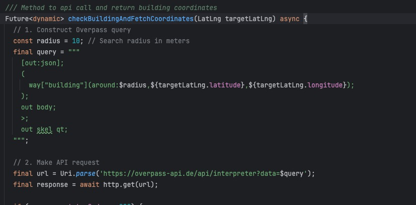
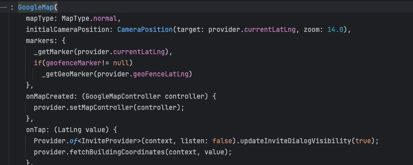

# Domi_demo

A Flutter project Demo with BottomSheet & Map.

## Project Setup & Run

### Clone project with the below URL

`git clone https://github.com/Abhishek01039/Domi-demo/tree/main`

### Execute the below command to set up and run the app

```
flutter clean
flutter pub get
flutter run
```

## Code/Folder Structure

```
- core
    - constants
    - models
    - provider
- ui
    - screens
    - widget
```

## Instruction to follow before running to load the map

Replace the map API key on Android on this file "project/android/app/src/main/AndroidManifest.xml"

```
<meta-data android:name="com.google.android.geo.API_KEY"
android:value="<-- API KEY -->"/>
```

Replace map API key on ios on this file "project/ios/Runner/AppDelegate.swift"

```
GMSServices.provideAPIKey("<-- API KEY -->")
```

Proof


https://github.com/user-attachments/assets/5fc16eb6-c223-4591-b093-2cdaa89de87e


**NOTE:**

I am using open street API to get the building location via latitude & longitude.



**That's why its offset is different than Google Maps**. If we use the open street for showing the map & get the building location then it will show the same location (building & polygon)


